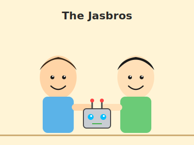
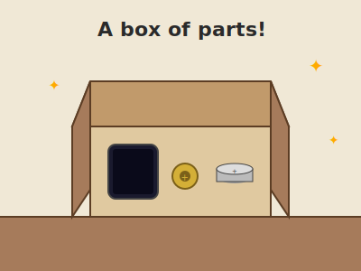
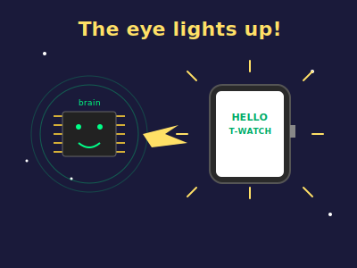
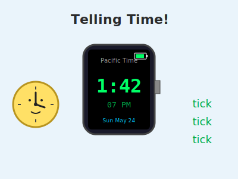
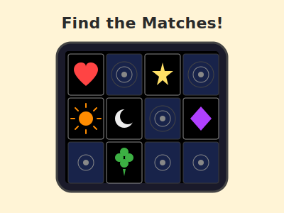
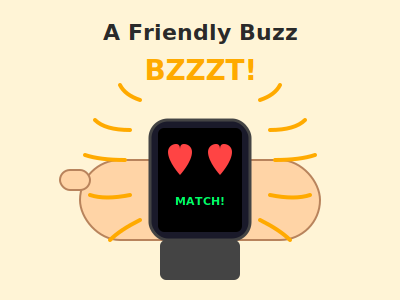
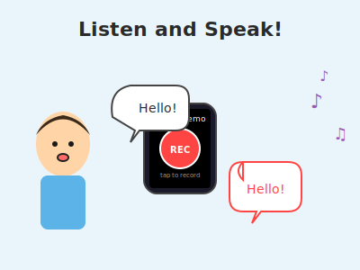
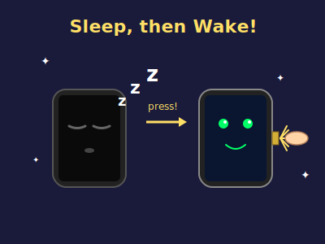
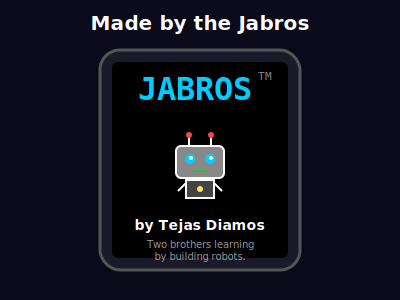
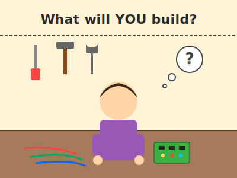

# How the Jasbros Built a Watch

A picture book.

_For a 6-year-old who likes robots._

---

## Page 1 — Two Brothers and an Idea

Tejas and his brother build robots.

They call themselves **the Jasbros**.

One day they said, "Let's build a watch!"

---

## Page 2 — A Box of Parts

A box came in the mail.

Inside was a tiny screen, a button shaped like a crown, and a battery the size of a coin.

"It's not a watch yet," said Tejas. "But it will be."

---

## Page 3 — The Brain and the Eye

The watch had a brain — a chip the size of a grain of rice.

It also had an eye — a tiny square screen.

The brothers flipped a hidden switch, and the eye lit up. **HELLO!**

---

## Page 4 — Telling Time

The brothers taught the watch to count seconds.

Tick. Tick. Tick.

Now the watch could show the time, all by itself.

---

## Page 5 — A Memory Game

A watch should be fun!

So they made a game with twelve little cards.

Hearts, stars, suns, moons, clovers, and diamonds — two of each. Can you find the matches?

---

## Page 6 — A Friendly Buzz

When you match a pair, the watch **buzzes** on your wrist.

**BZZZZZT!**

It feels like the watch is saying *"Good job!"*

---

## Page 7 — Listen and Speak

The watch has a tiny **ear** and a tiny **voice**.

Press the red button and say something silly.

Press the green button — and the watch says it back!

---

## Page 8 — Sleepy Watch, Awake Watch

After two minutes of doing nothing, the watch gets sleepy.

Its eye closes to save the battery.

Press the **crown** on the side — the watch is awake again!

---

## Page 9 — Their Name on It

The brothers put their name on the watch.

Swipe down on the screen, and a little robot pops up:

**JASBROS™ — by Tejas Diamos.**

---

## Page 10 — Your Turn

Anyone can build a watch.

Anyone can build a robot.

What will **you** build?

---

### About this book

This story is about a real watch built by two real brothers. The code that makes it work lives in `sketches/HelloWatch/`. The grown-up version of this story — with all the wires and chips — lives in [`docs/`](../docs/README.md).
